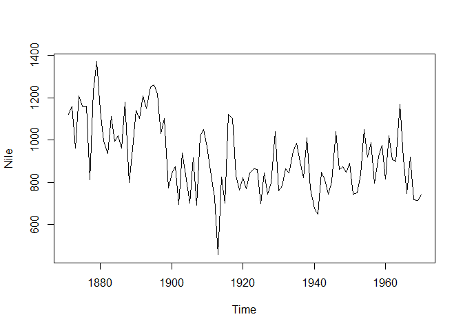
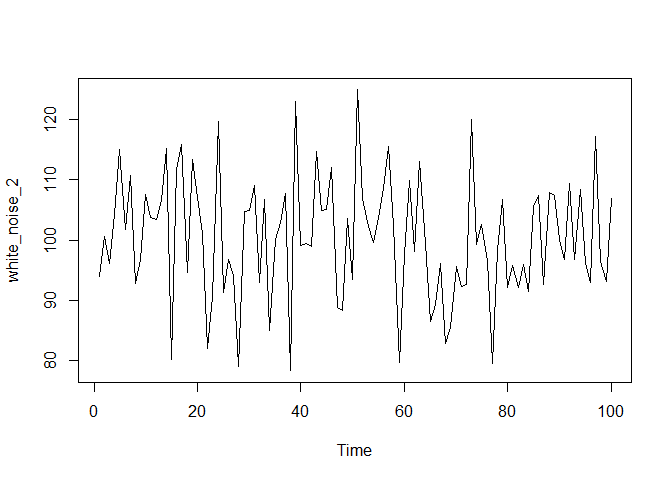
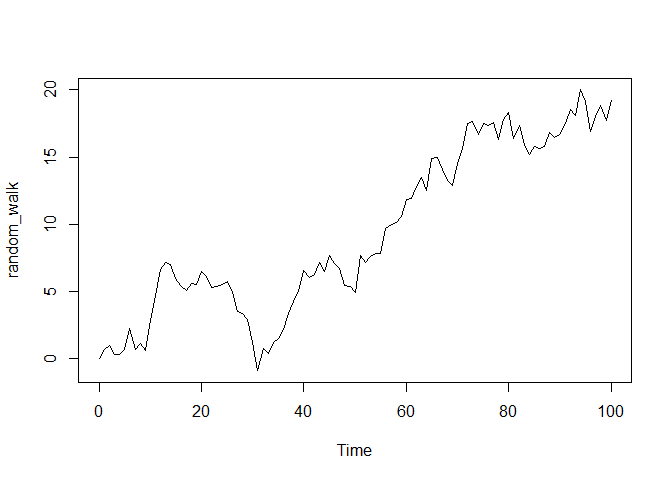
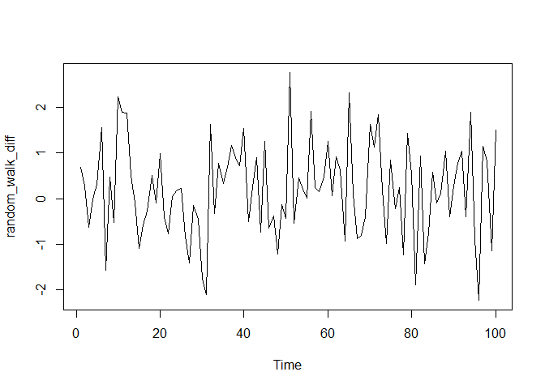
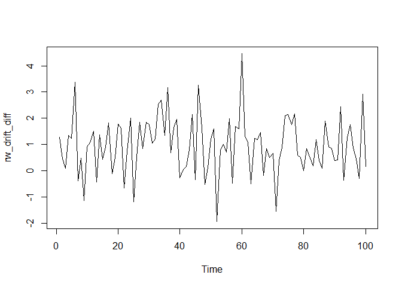
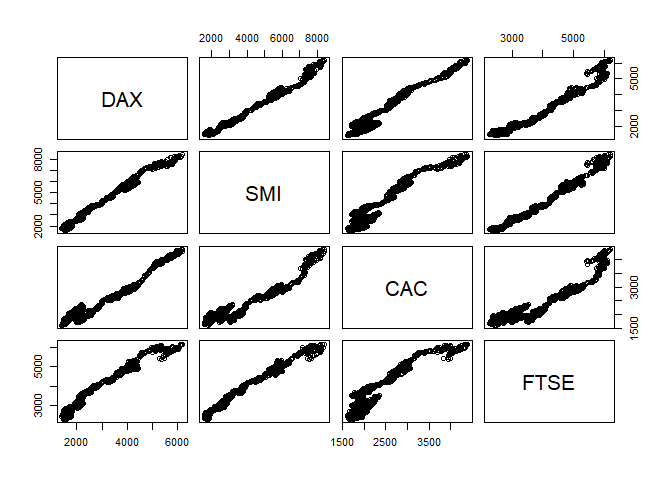

```r
# {r, echo = FALSE, results='hide'}
# if we used both 'echo=TRUE' and 'results=hide' the pipe would not work properly
# if we used 'echo = FALSE' and 'results=hide' we would have only messages (i.e. attaching package) If we don't want them we set 'error = FALSE', 'warning = FALSE', and 'message = FALSE'.
library(dplyr)
```

```
## 
## Attaching package: 'dplyr'
```

```
## The following objects are masked from 'package:stats':
## 
##     filter, lag
```

```
## The following objects are masked from 'package:base':
## 
##     intersect, setdiff, setequal, union
```

## Exploring raw time series


```r
Nile<-structure(c(1120, 1160, 963, 1210, 1160, 1160, 813, 1230, 1370, 
1140, 995, 935, 1110, 994, 1020, 960, 1180, 799, 958, 1140, 1100, 
1210, 1150, 1250, 1260, 1220, 1030, 1100, 774, 840, 874, 694, 
940, 833, 701, 916, 692, 1020, 1050, 969, 831, 726, 456, 824, 
702, 1120, 1100, 832, 764, 821, 768, 845, 864, 862, 698, 845, 
744, 796, 1040, 759, 781, 865, 845, 944, 984, 897, 822, 1010, 
771, 676, 649, 846, 812, 742, 801, 1040, 860, 874, 848, 890, 
744, 749, 838, 1050, 918, 986, 797, 923, 975, 815, 1020, 906, 
901, 1170, 912, 746, 919, 718, 714, 740), .Tsp = c(1871, 1970, 
1), class = "ts")

# Print the Nile dataset
print(Nile)
```

```
## Time Series:
## Start = 1871 
## End = 1970 
## Frequency = 1 
##   [1] 1120 1160  963 1210 1160 1160  813 1230 1370 1140  995  935 1110  994 1020
##  [16]  960 1180  799  958 1140 1100 1210 1150 1250 1260 1220 1030 1100  774  840
##  [31]  874  694  940  833  701  916  692 1020 1050  969  831  726  456  824  702
##  [46] 1120 1100  832  764  821  768  845  864  862  698  845  744  796 1040  759
##  [61]  781  865  845  944  984  897  822 1010  771  676  649  846  812  742  801
##  [76] 1040  860  874  848  890  744  749  838 1050  918  986  797  923  975  815
##  [91] 1020  906  901 1170  912  746  919  718  714  740
```

```r
# List the number of observations in the Nile dataset
length(Nile)
```

```
## [1] 100
```

```r
# Display the first 10 elements of the Nile dataset
head(Nile, 10)
```

```
##  [1] 1120 1160  963 1210 1160 1160  813 1230 1370 1140
```

```r
# Display the last 12 elements of the Nile dataset
tail(Nile, 12)
```

```
##  [1]  975  815 1020  906  901 1170  912  746  919  718  714  740
```

## Basic time series plots


```r
# Plot the Nile data
plot(Nile)
```

<!-- -->

```r
# Plot the Nile data with xlab and ylab arguments
plot(Nile, xlab = "Year", ylab = "River Volume (1e9 m^{3})")
```

<!-- -->

```r
# Plot the Nile data with xlab, ylab, main, and type arguments
plot(Nile, xlab = "Year", ylab = "River Volume (1e9 m^{3})", main = "Annual River Nile Volume at Aswan, 1871-1970", type = "b")
```

<!-- -->

## What does the time index tell us?


```r
# Plot the continuous_series using continuous time indexing
par(mfrow=c(2,1))
plot(continuous_time_index,continuous_series, type = "b")

# Make a discrete time index using 1:20 
discrete_time_index <- seq(1:20)

# Now plot the continuous_series using discrete time indexing
plot(discrete_time_index,continuous_series, type = "b")
```

<!-- -->

## Sampling frequency


```r
# Plot AirPassengers
plot(AirPassengers)
```

<!-- -->

```r
# View the start and end dates of AirPassengers
start(AirPassengers)
```

```
## [1] 1949    1
```

```r
end(AirPassengers)
```

```
## [1] 1960   12
```

```r
# Use time(), deltat(), frequency(), and cycle() with AirPassengers 
time(AirPassengers)
```

```
##           Jan      Feb      Mar      Apr      May      Jun      Jul      Aug
## 1949 1949.000 1949.083 1949.167 1949.250 1949.333 1949.417 1949.500 1949.583
## 1950 1950.000 1950.083 1950.167 1950.250 1950.333 1950.417 1950.500 1950.583
## 1951 1951.000 1951.083 1951.167 1951.250 1951.333 1951.417 1951.500 1951.583
## 1952 1952.000 1952.083 1952.167 1952.250 1952.333 1952.417 1952.500 1952.583
## 1953 1953.000 1953.083 1953.167 1953.250 1953.333 1953.417 1953.500 1953.583
## 1954 1954.000 1954.083 1954.167 1954.250 1954.333 1954.417 1954.500 1954.583
## 1955 1955.000 1955.083 1955.167 1955.250 1955.333 1955.417 1955.500 1955.583
## 1956 1956.000 1956.083 1956.167 1956.250 1956.333 1956.417 1956.500 1956.583
## 1957 1957.000 1957.083 1957.167 1957.250 1957.333 1957.417 1957.500 1957.583
## 1958 1958.000 1958.083 1958.167 1958.250 1958.333 1958.417 1958.500 1958.583
## 1959 1959.000 1959.083 1959.167 1959.250 1959.333 1959.417 1959.500 1959.583
## 1960 1960.000 1960.083 1960.167 1960.250 1960.333 1960.417 1960.500 1960.583
##           Sep      Oct      Nov      Dec
## 1949 1949.667 1949.750 1949.833 1949.917
## 1950 1950.667 1950.750 1950.833 1950.917
## 1951 1951.667 1951.750 1951.833 1951.917
## 1952 1952.667 1952.750 1952.833 1952.917
## 1953 1953.667 1953.750 1953.833 1953.917
## 1954 1954.667 1954.750 1954.833 1954.917
## 1955 1955.667 1955.750 1955.833 1955.917
## 1956 1956.667 1956.750 1956.833 1956.917
## 1957 1957.667 1957.750 1957.833 1957.917
## 1958 1958.667 1958.750 1958.833 1958.917
## 1959 1959.667 1959.750 1959.833 1959.917
## 1960 1960.667 1960.750 1960.833 1960.917
```

```r
deltat(AirPassengers)
```

```
## [1] 0.08333333
```

```r
frequency(AirPassengers)
```

```
## [1] 12
```

```r
cycle(AirPassengers)
```

```
##      Jan Feb Mar Apr May Jun Jul Aug Sep Oct Nov Dec
## 1949   1   2   3   4   5   6   7   8   9  10  11  12
## 1950   1   2   3   4   5   6   7   8   9  10  11  12
## 1951   1   2   3   4   5   6   7   8   9  10  11  12
## 1952   1   2   3   4   5   6   7   8   9  10  11  12
## 1953   1   2   3   4   5   6   7   8   9  10  11  12
## 1954   1   2   3   4   5   6   7   8   9  10  11  12
## 1955   1   2   3   4   5   6   7   8   9  10  11  12
## 1956   1   2   3   4   5   6   7   8   9  10  11  12
## 1957   1   2   3   4   5   6   7   8   9  10  11  12
## 1958   1   2   3   4   5   6   7   8   9  10  11  12
## 1959   1   2   3   4   5   6   7   8   9  10  11  12
## 1960   1   2   3   4   5   6   7   8   9  10  11  12
```

## Missing values

Still working with the AirPassengers data, but now there are missing values.


```r
# Plot the AirPassengers data
plot(AirPassengers)
```

<!-- -->

```r
# Compute the mean of AirPassengers
mean(AirPassengers, na.rm = TRUE)
```

```
## [1] 275.9394
```

```r
# Impute mean values to NA in AirPassengers
AirPassengers[85:96] <- mean(AirPassengers, na.rm = TRUE)

# Generate another plot of AirPassengers
plot(AirPassengers)

# Add the complete AirPassengers data to your plot
rm(AirPassengers)
points(AirPassengers, type = "l", col = 2, lty = 3)
```

<!-- -->

## Basic time series objects


```r
# Use print() and plot() to view data_vector
print(data_vector)
```

```
##  [1]  2.0521941073  4.2928852797  3.3294132944  3.5085950670  0.0009576938
##  [6]  1.9217186345  0.7978134128  0.2999543435  0.9435687536  0.5748283388
## [11] -0.0034005903  0.3448649176  2.2229761136  0.1763144576  2.7097622770
## [16]  1.2501948965 -0.4007164754  0.8852732121 -1.5852420266 -2.2829278891
## [21] -2.5609531290 -3.1259963754 -2.8660295895 -1.7847009207 -1.8894912908
## [26] -2.7255351194 -2.1033141800 -0.0174256893 -0.3613204151 -2.9008403327
## [31] -3.2847440927 -2.8684594718 -1.9505074437 -4.8801892525 -3.2634605353
## [36] -1.6396062522 -3.3012575840 -2.6331245433 -1.7058354022 -2.2119825061
## [41] -0.5170595186  0.0752508095 -0.8406994716 -1.4022683487 -0.1382114230
## [46] -1.4065954703 -2.3046941055  1.5073891432  0.7118679477 -1.1300519022
```

```r
plot(data_vector)
```

<!-- -->

```r
# Convert data_vector to a ts object with start = 2004 and frequency = 4
time_series <- ts(data_vector, start = 2004, frequency = 4)

# Use print() and plot() to view time_series
print(time_series)
```

```
##               Qtr1          Qtr2          Qtr3          Qtr4
## 2004  2.0521941073  4.2928852797  3.3294132944  3.5085950670
## 2005  0.0009576938  1.9217186345  0.7978134128  0.2999543435
## 2006  0.9435687536  0.5748283388 -0.0034005903  0.3448649176
## 2007  2.2229761136  0.1763144576  2.7097622770  1.2501948965
## 2008 -0.4007164754  0.8852732121 -1.5852420266 -2.2829278891
## 2009 -2.5609531290 -3.1259963754 -2.8660295895 -1.7847009207
## 2010 -1.8894912908 -2.7255351194 -2.1033141800 -0.0174256893
## 2011 -0.3613204151 -2.9008403327 -3.2847440927 -2.8684594718
## 2012 -1.9505074437 -4.8801892525 -3.2634605353 -1.6396062522
## 2013 -3.3012575840 -2.6331245433 -1.7058354022 -2.2119825061
## 2014 -0.5170595186  0.0752508095 -0.8406994716 -1.4022683487
## 2015 -0.1382114230 -1.4065954703 -2.3046941055  1.5073891432
## 2016  0.7118679477 -1.1300519022
```

```r
plot(time_series) 
```

<!-- -->

## Testing whether an object is a time series


```r
# Check whether Nile is a ts object
is.ts(Nile)
```

```
## [1] TRUE
```

## Plotting a time series object


```r
eu_stocks <- EuStockMarkets

# Check whether eu_stocks is a ts object
is.ts(eu_stocks)
```

```
## [1] TRUE
```

```r
# View the start, end, and frequency of eu_stocks
start(eu_stocks)
```

```
## [1] 1991  130
```

```r
end(eu_stocks)
```

```
## [1] 1998  169
```

```r
frequency(eu_stocks)
```

```
## [1] 260
```

```r
# Generate a simple plot of eu_stocks
plot(eu_stocks)
```

<!-- -->

```r
# Use ts.plot with eu_stocks
ts.plot(eu_stocks, col = 1:4, xlab = "Year", ylab = "Index Value", main = "Major European Stock Indices, 1991-1998")

# Add a legend to your ts.plot
legend("topleft", colnames(eu_stocks), lty = 1, col = 1:4, bty = "n")
```

<!-- -->

## Removing trends in variability via the logarithmic transformation


```r
# Log rapid_growth
linear_growth <-log(rapid_growth)
  
# Plot linear_growth using ts.plot()
ts.plot(linear_growth)
```

<!-- -->

## Removing trends in level by differencing


```r
# Generate the first difference of z
dz <- diff(z)
  
# Plot dz
ts.plot(dz)
```

<!-- -->

```r
# View the length of z and dz, respectively
length(z)
```

```
## [1] 200
```

```r
length(dz)
```

```
## [1] 199
```

## Removing seasonal trends with seasonal differencing


```r
# Generate a diff of x with lag = 4. Save this to dx
dx <- diff(x, lag = 4)
  
# Plot dx
ts.plot(dx)  
```

<!-- -->

```r
# View the length of x and dx, respectively 
length(x)
```

```
## [1] 100
```

```r
length(dx)
```

```
## [1] 96
```

```r
# observe
head(x, 8)
```

```
## [1]  -4.198033   9.569009   5.175143  -9.691646  -3.215294  10.843669   6.452159
## [8] -10.833559
```

```r
head(dx, 8)
```

```
## [1]  0.9827398  1.2746603  1.2770153 -1.1419127  0.9799428 -0.7238363  0.1274871
## [8]  2.1769943
```

## Simulate the white noise model

An ARIMA(p, d, q) model has three parts: 

- p: the autoregressive order, 

- d: the order of integration (or differencing) 

- q: the moving average order


```r
# Simulate a WN model with list(order = c(0, 0, 0))
white_noise <- arima.sim(model = list(order = c(0, 0, 0)), n = 100)

# Plot your white_noise data
ts.plot(white_noise)
```

<!-- -->

```r
# Simulate from the WN model with: mean = 100, sd = 10
white_noise_2 <- arima.sim(model = list(order = c(0, 0, 0)), n = 100, mean = 100, sd = 10)

# Plot your white_noise_2 data
ts.plot(white_noise_2)
```

<!-- -->

## Estimate the white noise model

<!-- -->


```r
# Fit the WN model to y using the arima command
arima(y, order = c(0, 0, 0))
```

```
## 
## Call:
## arima(x = y, order = c(0, 0, 0))
## 
## Coefficients:
##       intercept
##         97.5428
## s.e.     0.9697
## 
## sigma^2 estimated as 94.03:  log likelihood = -369.08,  aic = 742.15
```

```r
# Calculate the sample mean and sample variance of y and compare with the previous output
mean(y)
```

```
## [1] 97.54284
```

```r
var(y)
```

```
## [1] 94.98175
```

```r
# The means are identical, the variances are close.
```

## The random walk (RW) model

$$
Y_t = Y_{t-1} + \epsilon_t,
$$
where $\epsilon_t$ is mean zero white noise.

- has only one parameter $\sigma_{\epsilon}^2$

- Simulation requires an initial point $Y_0$.

## Random walk with drift

$$
Y_t = c + Y_{t-1} + \epsilon_t,
$$
where $\epsilon_t$ is mean zero white noise.

- has two parameters, drift constant $c$ and $\sigma_{\epsilon}^2$

## Simulate the random walk model


```r
# Generate a RW model using arima.sim
random_walk <- arima.sim(model = list(order = c(0, 1, 0)), n = 100)

# Plot random_walk
ts.plot(random_walk)
```

<!-- -->

```r
# Calculate the first difference series
random_walk_diff <- diff(random_walk)

# Plot random_walk_diff
ts.plot(random_walk_diff)  
```

<!-- -->

## Simulate the random walk model with a drift


```r
# Generate a RW model with a drift uing arima.sim
rw_drift <- arima.sim(model = list(order = c(0, 1, 0)), n = 100, mean = 1)

# Plot rw_drift
ts.plot(rw_drift)
```

<!-- -->

```r
# Calculate the first difference series
rw_drift_diff <- diff(rw_drift)

# Plot rw_drift_diff
ts.plot(rw_drift_diff)
```

<!-- -->

Once again, taking the first difference of your random walk data transformed it back into white noise data, regardless of the presence of your long-term drift.

## Estimate the random walk model


```r
# Difference your random_walk data
rw_diff <- diff(random_walk)

# Plot rw_diff
ts.plot(rw_diff)
```

<!-- -->

```r
# Now fit the WN model to the differenced data
model_wn <- arima(rw_diff, order = c(0, 0, 0))

# Store the value of the estimated time trend (intercept)
int_wn <- model_wn$coef

# Plot the original random_walk data
ts.plot(random_walk)

# Use abline(0, ...) to add time trend to the figure
abline(0, int_wn, col = "red")
```

<!-- -->

The `arima()` command correctly identified the time trend in your original random-walk data.

## Stationary Processes

Constant mean and variance across time. 

Weakly stationary:

$$
Cov[Y_t, Y_s] = Cov[Y_i,Y_j]
$$

for all $t,s,i,j$ such that $|t-s| = |i -j|$.

## Are the white noise model or the random walk model stationary?

The white noise (WN) and random walk (RW) models are very closely related. However, only the RW is always non-stationary, both with and without a drift term. This is a simulation exercise to highlight the differences.


```r
set.seed(61)

# Use arima.sim() to generate WN data
white_noise <- arima.sim(model = list(order = c(0, 0, 0)), n =100)

# Use cumsum() to convert your WN data to RW
random_walk <- cumsum(white_noise)
  
# Use arima.sim() to generate WN drift data
wn_drift <- arima.sim(model = list(order = c(0, 0, 0)), n =100, mean = 0.4)
  
# Use cumsum() to convert your WN drift data to RW
rw_drift <- cumsum(wn_drift)

# Plot all four data objects
plot.ts(cbind(white_noise, random_walk, wn_drift, rw_drift))
```

<!-- -->

## Asset prices vs. asset returns


```r
# Plot eu_stocks
plot(eu_stocks)
```

<!-- -->

```r
# Use this code to convert prices to returns
returns <- eu_stocks[-1,] / eu_stocks[-1860,] - 1

# Convert returns to ts
returns <- ts(returns, start = c(1991, 130), frequency = 260)

# Plot returns
plot(returns)
```

<!-- -->

```r
# Use this code to convert prices to log returns
logreturns <- diff(log(eu_stocks))

# Plot logreturns
plot(logreturns)
```

<!-- -->

## Characteristics of financial time series


```r
head(eu_percentreturns)

# Generate means from eu_percentreturns
colMeans(eu_percentreturns)

# Use apply to calculate sample variance from eu_percentreturns
apply(eu_percentreturns, MARGIN = 2, FUN = var)

# Use apply to calculate standard deviation from eu_percentreturns
apply(eu_percentreturns, MARGIN = 2, FUN = sd)

# Display a histogram of percent returns for each index
par(mfrow = c(2,2))
apply(eu_percentreturns, MARGIN = 2, FUN = hist, main = "", xlab = "Percentage Return")

# Display normal quantile plots of percent returns for each index
par(mfrow = c(2,2))
apply(eu_percentreturns, MARGIN = 2, FUN = qqnorm, main = "")
qqline(eu_percentreturns)
```

## Plotting pairs of data


```r
DAX <- eu_stocks[, 1]
FTSE <- eu_stocks[, 4]

# Make a scatterplot of DAX and FTSE
plot(DAX, FTSE)
```

<!-- -->

```r
# Make a scatterplot matrix of eu_stocks
pairs(eu_stocks)
```

<!-- -->

```r
# Convert eu_stocks to log returns
logreturns <- diff(log(eu_stocks))

# Plot logreturns
plot(logreturns)
```

<!-- -->

```r
# Make a scatterplot matrix of logreturns
pairs(logreturns)
```

<!-- -->

## covariance and correlation


```r
# Use cov() with DAX_logreturns and FTSE_logreturns
cov(DAX_logreturns, FTSE_logreturns)

# Use cov() with logreturns
cov(logreturns)

# Use cor() with DAX_logreturns and FTSE_logreturns
cor(DAX_logreturns, FTSE_logreturns)

# Use cor() with logreturns
cor(logreturns)
```

## Autocorrelation


```r
head(x)
```

```
## [1]  2.0655438  1.2996380  0.0335780 -0.3425807  0.2325613  0.4681201
```

```r
n <- length(x)
n
```

```
## [1] 150
```

```r
# Define x_t0 as x[-1]
x_t0 <- x[-1]

# Define x_t1 as x[-n]
x_t1 <- x[-n]

# Confirm that x_t0 and x_t1 are (x[t], x[t-1]) pairs  
head(cbind(x_t0, x_t1))
```

```
##            x_t0       x_t1
## [1,]  1.2996380  2.0655438
## [2,]  0.0335780  1.2996380
## [3,] -0.3425807  0.0335780
## [4,]  0.2325613 -0.3425807
## [5,]  0.4681201  0.2325613
## [6,]  4.3411156  0.4681201
```

```r
# Plot x_t0 and x_t1
plot(x_t0, x_t1)
```

<!-- -->

```r
# View the correlation between x_t0 and x_t1
cor(x_t0, x_t1)
```

```
## [1] 0.7630314
```

```r
# Use acf with x
acf(x, lag.max = 1, plot = FALSE)
```

```
## 
## Autocorrelations of series 'x', by lag
## 
##     0     1 
## 1.000 0.758
```

```r
# Confirm that difference factor is (n-1)/n
cor(x_t1, x_t0) * (n-1)/n
```

```
## [1] 0.7579445
```

## The autocorrelation function


```r
# Generate ACF estimates for x up to lag-10
acf(x, lag.max = 10, plot = FALSE)
```

```
## 
## Autocorrelations of series 'x', by lag
## 
##     0     1     2     3     4     5     6     7     8     9    10 
## 1.000 0.758 0.537 0.345 0.227 0.198 0.140 0.114 0.124 0.118 0.100
```

```r
# Type the ACF estimate at lag-10 
acf(x, lag.max = 10, plot = FALSE)[10]
```

```
## 
## Autocorrelations of series 'x', by lag
## 
##  10 
## 0.1
```

```r
# Type the ACF estimate at lag-5
acf(x, lag.max = 10, plot = FALSE)[5]
```

```
## 
## Autocorrelations of series 'x', by lag
## 
##     5 
## 0.198
```

## Visualizing the autocorrelation function


```r
acf(x)
```

<!-- -->

## The autoregressive model

The autoregressive (AR) model is arguably the most widely used time series model. It shares the very familiar interpretation of a simple linear regression, but here each observation is regressed on the previous observation.

$$
Y_t - \mu = \phi(Y_{t-1} - \mu) + \epsilon_t
$$

where $\epsilon_t$ is zero mean white noise. This model has three parameters:

- the mean $\mu$

- the slope $\phi$

- the white noise variance $\sigma^2$.

Note that if 

- $\phi =0$, then the model simplifies to a white noise process with mean $\mu$.

- $\phi =1$ and $\mu = 0$, the model reduces to a random walk.

## Simulate the autoregressive model


```r
# Simulate an AR model with 0.5 slope
x <- arima.sim(model = list(ar = 0.5), n = 100)

# Simulate an AR model with 0.9 slope
y <- arima.sim(model = list(ar = 0.9), n = 100)

# Simulate an AR model with -0.75 slope
z <- arima.sim(model = list(ar = -0.75), n = 100)

# Plot your simulated data
plot.ts(cbind(x, y, z))
```

<!-- -->

## Estimate the autocorrelation function (ACF) for an autoregression


```r
# Calculate the ACF for x
acf(x)
```

<!-- -->

```r
# Calculate the ACF for y
acf(y)
```

<!-- -->

```r
# Calculate the ACF for z
acf(z)
```

<!-- -->

## Compare the random walk (RW) and autoregressive (AR) models

The random walk (RW) model is a special case of the autoregressive (AR) model, in which the slope parameter is equal to 1. Recall from previous chapters that the RW model is not stationary and exhibits very strong persistence. Its sample autocovariance function (ACF) also decays to zero very slowly, meaning past values have a long lasting impact on current values.

The stationary AR model has a slope parameter between -1 and 1. The AR model exhibits higher persistence when its slope parameter is closer to 1, but the process reverts to its mean fairly quickly. Its sample ACF also decays to zero at a quick (geometric) rate, indicating that values far in the past have little impact on future values of the process.

In this exercise, you'll explore these qualities by simulating and plotting additional data from an AR model.


```r
set.seed(61)

# Simulate and plot AR model with slope 0.9 
x <- arima.sim(model = list(ar = 0.9), n = 200)
ts.plot(x)
```

<!-- -->

```r
acf(x)
```

<!-- -->

```r
# Simulate and plot AR model with slope 0.98
y <- arima.sim(model = list(ar = 0.98), n = 200)
ts.plot(y)
```

<!-- -->

```r
acf(y)
```

<!-- -->

```r
# Simulate and plot RW model
z <- arima.sim(model = list(order = c(0, 1, 0)), n = 200)
ts.plot(z)
```

<!-- -->

```r
acf(z)
```

<!-- -->

As you can see, the AR model represented by series y exhibits greater persistence than series x, but the ACF continues to decay to 0. By contrast, the RW model represented by series z shows considerable persistence and relatively little decay in the ACF.

## AR model estimation and forecasting


```r
set.seed(61)

# Fit the AR model to x
arima(x, order = c(1, 0, 0))
```

```
## 
## Call:
## arima(x = x, order = c(1, 0, 0))
## 
## Coefficients:
##          ar1  intercept
##       0.8575    -0.0948
## s.e.  0.0491     0.6703
## 
## sigma^2 estimated as 1.022:  log likelihood = -143.66,  aic = 293.32
```

```r
# Copy and paste the slope (ar1) estimate


# Copy and paste the slope mean (intercept) estimate


# Copy and paste the innovation variance (sigma^2) estimate


# Fit the AR model to AirPassengers
AR <- arima(AirPassengers, order = c(1, 0, 0))
print(AR)
```

```
## 
## Call:
## arima(x = AirPassengers, order = c(1, 0, 0))
## 
## Coefficients:
##          ar1  intercept
##       0.9646   278.4649
## s.e.  0.0214    67.1141
## 
## sigma^2 estimated as 1119:  log likelihood = -711.09,  aic = 1428.18
```

```r
# Run the following commands to plot the series and fitted values
ts.plot(AirPassengers)
AR_fitted <- AirPassengers - residuals(AR)
points(AR_fitted, type = "l", col = 2, lty = 2)
```

<!-- -->

## Simple forecasts from an estimated AR model


```r
# Fit an AR model to Nile
AR_fit <- arima(Nile, order  = c(1, 0, 0))
print(AR_fit)
```

```
## 
## Call:
## arima(x = Nile, order = c(1, 0, 0))
## 
## Coefficients:
##          ar1  intercept
##       0.5063   919.5685
## s.e.  0.0867    29.1410
## 
## sigma^2 estimated as 21125:  log likelihood = -639.95,  aic = 1285.9
```

```r
# Use predict() to make a 1-step forecast
predict_AR <- predict(AR_fit, n.ahead = 1)

# Obtain the 1-step forecast using $pred[1]
predict_AR$pred[1]
```

```
## [1] 828.6576
```

```r
# Use predict to make 1-step through 10-step forecasts
predict(AR_fit, n.ahead = 10)
```

```
## $pred
## Time Series:
## Start = 1971 
## End = 1980 
## Frequency = 1 
##  [1] 828.6576 873.5426 896.2668 907.7715 913.5960 916.5448 918.0377 918.7935
##  [9] 919.1762 919.3699
## 
## $se
## Time Series:
## Start = 1971 
## End = 1980 
## Frequency = 1 
##  [1] 145.3439 162.9092 167.1145 168.1754 168.4463 168.5156 168.5334 168.5380
##  [9] 168.5391 168.5394
```

```r
# Run to plot the Nile series plus the forecast and 95% prediction intervals
ts.plot(Nile, xlim = c(1871, 1980))
AR_forecast <- predict(AR_fit, n.ahead = 10)$pred
AR_forecast_se <- predict(AR_fit, n.ahead = 10)$se
points(AR_forecast, type = "l", col = 2)
points(AR_forecast - 2*AR_forecast_se, type = "l", col = 2, lty = 2)
points(AR_forecast + 2*AR_forecast_se, type = "l", col = 2, lty = 2)
```

<!-- -->

## Simulate the simple moving average model

The simple moving average (MA) model is a parsimonious time series model used to account for very short-run autocorrelation. It does have a regression like form, but here each observation is regressed on the previous innovation, which is not actually observed. Like the autoregressive (AR) model, the MA model includes the white noise (WN) model as special case.

As with previous models, the MA model can be simulated using the arima.sim() command by setting the model argument to list(ma = theta), where theta is a slope parameter from the interval (-1, 1). Once again, you also need to specify the series length using the n argument.

In this exercise, you'll simulate and plot three MA models with slope parameters 0.5, 0.9, and -0.5, respectively.

Instructions:

- Use arima.sim() to simulate a MA model with the slope parameter set to 0.5, and series length 100. Save this model to x.
- Use another call to arima.sim() to simulate a MA model with the slope parameter set to 0.9. Save this model to y.
- Use a third call to arima.sim() to simulate a final MA model with the slope parameter set to -0.5. Save this model to z.
- Use plot.ts() to display all three models.


```r
set.seed(0220)

# Generate MA model with slope 0.5
x <- arima.sim(model = list(ma = 0.5), n = 100)

# Generate MA model with slope 0.9
y <- arima.sim(model = list(ma = 0.9), n = 100)

# Generate MA model with slope -0.5
z <- arima.sim(model = list(ma = -0.5), n = 100)

# Plot all three models together
plot.ts(cbind(x, y, z))
```

<!-- -->

Great job! Note that there is some very short-run persistence for the positive slope values (x and y), and the series has a tendency to alternate when the slope value is negative (z).

## Estimate the autocorrelation function (ACF) for a moving average

Now that you've simulated some MA data using the arima.sim() command, you may want to estimate the autocorrelation functions (ACF) for your data. As in the previous chapter, you can use the acf() command to generate plots of the autocorrelation in your MA data.

In this exercise, you'll use acf() to estimate the ACF for three simulated MA series, x, y, and z. These series have slope parameters of 0.4, 0.9, and -0.75, respectively, and are shown in the figure on the right.


```r
# Calculate ACF for x
acf(x)
```

<!-- -->

```r
# Calculate ACF for y
acf(y)
```

<!-- -->

```r
# Calculate ACF for z
acf(z)
```

<!-- -->

Well done! As you can see from your ACF plots, the series x has positive sample autocorrelation at the first lag, but it is approximately zero at other lags. The series y has a larger sample autocorrelation at its first lag, but it is also approximately zero for the others. The series z has an alternating pattern, and its sample autocorrelation is negative at the first lag. However, similar to the others, it is approximately zero for all higher lags.

## Estimate the simple moving average model

Now that you've simulated some MA models and calculated the ACF from these models, your next step is to fit the simple moving average (MA) model to some data using the arima() command. For a given time series x we can fit the simple moving average (MA) model using arima(..., order = c(0, 0, 1)). Note for reference that an MA model is an ARIMA(0, 0, 1) model.

In this exercise, you'll practice using a preloaded time series (x, shown in the plot on the right) as well as the Nile dataset used in earlier chapters.


- Use arima() to fit the MA model to the series x.
- What are the slope (ma1), mean (intercept), and innovation variance (sigma^2) estimates produced by your arima() output? Paste these into your workspace.
- Use a similar call to arima() to fit the MA model to the Nile data. Save the results as MA and use print() to display the output.
- Finally, use the pre-written commands to plot the Nile data and your fitted MA values.


```r
# Fit the MA model to x
arima(x, order = c(0, 0, 1))
```

```
## 
## Call:
## arima(x = x, order = c(0, 0, 1))
## 
## Coefficients:
##          ma1  intercept
##       0.7928     0.1589
## s.e.  0.0902     0.1747
## 
## sigma^2 estimated as 0.9576:  log likelihood = -140.22,  aic = 286.44
```

```r
# Paste the slope (ma1) estimate below
arima(x, order = c(0, 0, 1))[["coef"]][1]
```

```
##       ma1 
## 0.7927576
```

```r
# Paste the slope mean (intercept) estimate below
arima(x, order = c(0, 0, 1))[["coef"]][2]
```

```
## intercept 
## 0.1589291
```

```r
# Paste the innovation variance (sigma^2) estimate below
arima(x, order = c(0, 0, 1))[["sigma2"]]
```

```
## [1] 0.9575542
```

```r
# Fit the MA model to Nile
MA <- arima(Nile, order = c(0, 0, 1))
print(MA)
```

```
## 
## Call:
## arima(x = Nile, order = c(0, 0, 1))
## 
## Coefficients:
##          ma1  intercept
##       0.3783   919.2433
## s.e.  0.0791    20.9685
## 
## sigma^2 estimated as 23272:  log likelihood = -644.72,  aic = 1295.44
```

```r
# Plot Nile and MA_fit 
ts.plot(Nile)
MA_fit <- Nile - resid(MA)
points(MA_fit, type = "l", col = 2, lty = 2)
```

<!-- -->

Excellent work! By fitting an MA model to your Nile data, you're able to capture variation in the data for future prediction. Based on the plot you've generated, does the MA model appear to be a strong fit for the Nile data?

## Simple forecasts from an estimated MA model

Now that you've estimated a MA model with your Nile data, the next step is to do some simple forecasting with your model. As with other types of models, you can use the predict() function to make simple forecasts from your estimated MA model. Recall that the $pred value is the forecast, while the $se value is a standard error for that forecast, each of which is based on the fitted MA model.

Once again, to make predictions for several periods beyond the last observation you can use the n.ahead = h argument in your call to predict(). The forecasts are made recursively from 1 to h-steps ahead from the end of the observed time series. However, note that except for the 1-step forecast, all forecasts from the MA model are equal to the estimated mean (intercept).

In this exercise, you'll use the MA model derived from your Nile data to make simple forecasts about future River Nile flow levels. Your MA model from the previous exercise is available in your environment.

Instructions:

- Use predict() to make a forecast for River Nile flow level in 1971. Store the forecast in predict_MA.
- Use predict_MA along with $pred[1] to obtain the 1-step forecast.
- Use another call to predict() to make a forecast from 1971 through 1980. To do so, set the n.ahead argument equal to 10.
- Run the pre-written code to plot the Nile time series plus the forecast and 95% prediction intervals.


```r
# Make a 1-step forecast based on MA
predict_MA <-predict(MA)

# Obtain the 1-step forecast using $pred[1]
predict_MA$pred[1]
```

```
## [1] 868.8747
```

```r
# Make a 1-step through 10-step forecast based on MA
predict(MA, n.ahead = 10)
```

```
## $pred
## Time Series:
## Start = 1971 
## End = 1980 
## Frequency = 1 
##  [1] 868.8747 919.2433 919.2433 919.2433 919.2433 919.2433 919.2433 919.2433
##  [9] 919.2433 919.2433
## 
## $se
## Time Series:
## Start = 1971 
## End = 1980 
## Frequency = 1 
##  [1] 152.5508 163.1006 163.1006 163.1006 163.1006 163.1006 163.1006 163.1006
##  [9] 163.1006 163.1006
```

```r
# Plot the Nile series plus the forecast and 95% prediction intervals
ts.plot(Nile, xlim = c(1871, 1980))
MA_forecasts <- predict(MA, n.ahead = 10)$pred
MA_forecast_se <- predict(MA, n.ahead = 10)$se
points(MA_forecasts, type = "l", col = 2)
points(MA_forecasts - 2*MA_forecast_se, type = "l", col = 2, lty = 2)
points(MA_forecasts + 2*MA_forecast_se, type = "l", col = 2, lty = 2)
```

<!-- -->

Well done! Note that the MA model can only produce a 1-step forecast. For additional forecasting periods, the predict() command simply extends the original 1-step forecast. This explains the unexpected horizontal lines after 1971.

## AR vs MA models

As you've seen, autoregressive (AR) and simple moving average (MA) are two useful approaches to modeling time series. But how can you determine whether an AR or MA model is more appropriate in practice?

To determine model fit, you can measure the Akaike information criterion (AIC) and Bayesian information criterion (BIC) for each model. While the math underlying the AIC and BIC is beyond the scope of this course, for your purposes the main idea is these these indicators penalize models with more estimated parameters, to avoid overfitting, and smaller values are preferred. All factors being equal, a model that produces a lower AIC or BIC than another model is considered a better fit.

To estimate these indicators, you can use the AIC() and BIC() commands, both of which require a single argument to specify the model in question.

In this exercise, you'll return to the Nile data and the AR and MA models you fitted to this data. These models and their predictions for the 1970s (AR_fit) and (MA_fit) are depicted in the plot on the right.

Instructions:

- As a first step in comparing these models, use cor() to measure the correlation between AR_fit and MA_fit.
- Use two calls to AIC() to calculate the AIC for AR and MA, respectively.
- Use two calls to BIC() to calculate the BIC for AR and MA, respectively.


```r
# Find correlation between AR_fit and MA_fit
#cor(AR_fit, MA_fit)

# Find AIC of AR
AIC(AR)
```

```
## [1] 1428.179
```

```r
# Find AIC of MA
AIC(MA)
```

```
## [1] 1295.442
```

```r
# Find BIC of AR
BIC(AR)
```

```
## [1] 1437.089
```

```r
# Find BIC of MA
BIC(MA)
```

```
## [1] 1303.257
```
Well done! Although the predictions from both models are very similar (indeed, they have a correlation coeffiicent of 0.94), both the AIC and BIC indicate that the AR model is a slightly better fit for your Nile data.


