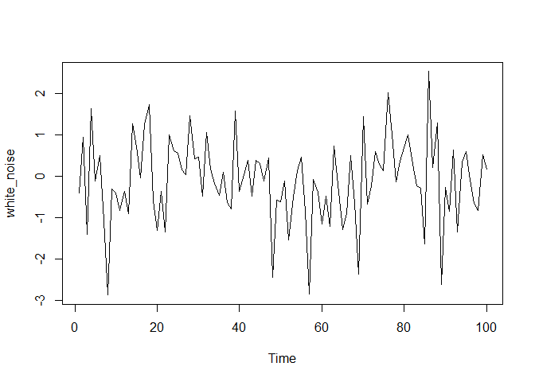
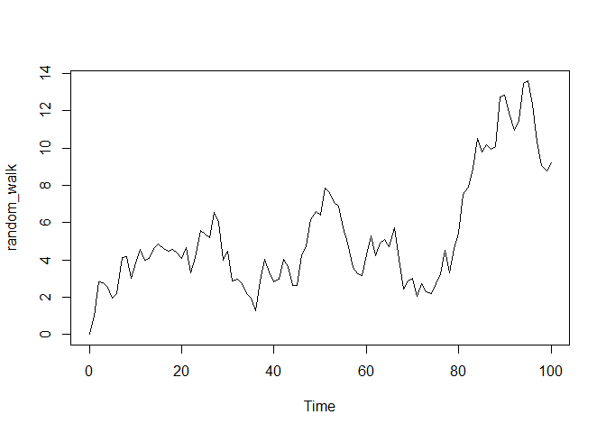
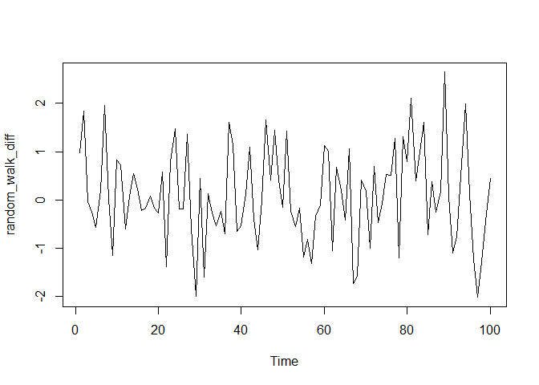

```r
# {r, echo = FALSE, results='hide'}
# if we used both 'echo=TRUE' and 'results=hide' the pipe would not work properly
# if we used 'echo = FALSE' and 'results=hide' we would have only messages (i.e. attaching package) If we don't want them we set 'error = FALSE', 'warning = FALSE', and 'message = FALSE'.
library(dplyr)
```

```
## 
## Attaching package: 'dplyr'
```

```
## The following objects are masked from 'package:stats':
## 
##     filter, lag
```

```
## The following objects are masked from 'package:base':
## 
##     intersect, setdiff, setequal, union
```

## Exploring raw time series


```r
Nile<-structure(c(1120, 1160, 963, 1210, 1160, 1160, 813, 1230, 1370, 
1140, 995, 935, 1110, 994, 1020, 960, 1180, 799, 958, 1140, 1100, 
1210, 1150, 1250, 1260, 1220, 1030, 1100, 774, 840, 874, 694, 
940, 833, 701, 916, 692, 1020, 1050, 969, 831, 726, 456, 824, 
702, 1120, 1100, 832, 764, 821, 768, 845, 864, 862, 698, 845, 
744, 796, 1040, 759, 781, 865, 845, 944, 984, 897, 822, 1010, 
771, 676, 649, 846, 812, 742, 801, 1040, 860, 874, 848, 890, 
744, 749, 838, 1050, 918, 986, 797, 923, 975, 815, 1020, 906, 
901, 1170, 912, 746, 919, 718, 714, 740), .Tsp = c(1871, 1970, 
1), class = "ts")

# Print the Nile dataset
print(Nile)
```

```
## Time Series:
## Start = 1871 
## End = 1970 
## Frequency = 1 
##   [1] 1120 1160  963 1210 1160 1160  813 1230 1370 1140  995  935 1110  994 1020
##  [16]  960 1180  799  958 1140 1100 1210 1150 1250 1260 1220 1030 1100  774  840
##  [31]  874  694  940  833  701  916  692 1020 1050  969  831  726  456  824  702
##  [46] 1120 1100  832  764  821  768  845  864  862  698  845  744  796 1040  759
##  [61]  781  865  845  944  984  897  822 1010  771  676  649  846  812  742  801
##  [76] 1040  860  874  848  890  744  749  838 1050  918  986  797  923  975  815
##  [91] 1020  906  901 1170  912  746  919  718  714  740
```

```r
# List the number of observations in the Nile dataset
length(Nile)
```

```
## [1] 100
```

```r
# Display the first 10 elements of the Nile dataset
head(Nile, 10)
```

```
##  [1] 1120 1160  963 1210 1160 1160  813 1230 1370 1140
```

```r
# Display the last 12 elements of the Nile dataset
tail(Nile, 12)
```

```
##  [1]  975  815 1020  906  901 1170  912  746  919  718  714  740
```

## Basic time series plots


```r
# Plot the Nile data
plot(Nile)
```

<!-- -->

```r
# Plot the Nile data with xlab and ylab arguments
plot(Nile, xlab = "Year", ylab = "River Volume (1e9 m^{3})")
```

<!-- -->

```r
# Plot the Nile data with xlab, ylab, main, and type arguments
plot(Nile, xlab = "Year", ylab = "River Volume (1e9 m^{3})", main = "Annual River Nile Volume at Aswan, 1871-1970", type = "b")
```

<!-- -->

## What does the time index tell us?


```r
# Plot the continuous_series using continuous time indexing
par(mfrow=c(2,1))
plot(continuous_time_index,continuous_series, type = "b")

# Make a discrete time index using 1:20 
discrete_time_index <- seq(1:20)

# Now plot the continuous_series using discrete time indexing
plot(discrete_time_index,continuous_series, type = "b")
```

<!-- -->

## Sampling frequency


```r
# Plot AirPassengers
plot(AirPassengers)
```

<!-- -->

```r
# View the start and end dates of AirPassengers
start(AirPassengers)
```

```
## [1] 1949    1
```

```r
end(AirPassengers)
```

```
## [1] 1960   12
```

```r
# Use time(), deltat(), frequency(), and cycle() with AirPassengers 
time(AirPassengers)
```

```
##           Jan      Feb      Mar      Apr      May      Jun      Jul      Aug
## 1949 1949.000 1949.083 1949.167 1949.250 1949.333 1949.417 1949.500 1949.583
## 1950 1950.000 1950.083 1950.167 1950.250 1950.333 1950.417 1950.500 1950.583
## 1951 1951.000 1951.083 1951.167 1951.250 1951.333 1951.417 1951.500 1951.583
## 1952 1952.000 1952.083 1952.167 1952.250 1952.333 1952.417 1952.500 1952.583
## 1953 1953.000 1953.083 1953.167 1953.250 1953.333 1953.417 1953.500 1953.583
## 1954 1954.000 1954.083 1954.167 1954.250 1954.333 1954.417 1954.500 1954.583
## 1955 1955.000 1955.083 1955.167 1955.250 1955.333 1955.417 1955.500 1955.583
## 1956 1956.000 1956.083 1956.167 1956.250 1956.333 1956.417 1956.500 1956.583
## 1957 1957.000 1957.083 1957.167 1957.250 1957.333 1957.417 1957.500 1957.583
## 1958 1958.000 1958.083 1958.167 1958.250 1958.333 1958.417 1958.500 1958.583
## 1959 1959.000 1959.083 1959.167 1959.250 1959.333 1959.417 1959.500 1959.583
## 1960 1960.000 1960.083 1960.167 1960.250 1960.333 1960.417 1960.500 1960.583
##           Sep      Oct      Nov      Dec
## 1949 1949.667 1949.750 1949.833 1949.917
## 1950 1950.667 1950.750 1950.833 1950.917
## 1951 1951.667 1951.750 1951.833 1951.917
## 1952 1952.667 1952.750 1952.833 1952.917
## 1953 1953.667 1953.750 1953.833 1953.917
## 1954 1954.667 1954.750 1954.833 1954.917
## 1955 1955.667 1955.750 1955.833 1955.917
## 1956 1956.667 1956.750 1956.833 1956.917
## 1957 1957.667 1957.750 1957.833 1957.917
## 1958 1958.667 1958.750 1958.833 1958.917
## 1959 1959.667 1959.750 1959.833 1959.917
## 1960 1960.667 1960.750 1960.833 1960.917
```

```r
deltat(AirPassengers)
```

```
## [1] 0.08333333
```

```r
frequency(AirPassengers)
```

```
## [1] 12
```

```r
cycle(AirPassengers)
```

```
##      Jan Feb Mar Apr May Jun Jul Aug Sep Oct Nov Dec
## 1949   1   2   3   4   5   6   7   8   9  10  11  12
## 1950   1   2   3   4   5   6   7   8   9  10  11  12
## 1951   1   2   3   4   5   6   7   8   9  10  11  12
## 1952   1   2   3   4   5   6   7   8   9  10  11  12
## 1953   1   2   3   4   5   6   7   8   9  10  11  12
## 1954   1   2   3   4   5   6   7   8   9  10  11  12
## 1955   1   2   3   4   5   6   7   8   9  10  11  12
## 1956   1   2   3   4   5   6   7   8   9  10  11  12
## 1957   1   2   3   4   5   6   7   8   9  10  11  12
## 1958   1   2   3   4   5   6   7   8   9  10  11  12
## 1959   1   2   3   4   5   6   7   8   9  10  11  12
## 1960   1   2   3   4   5   6   7   8   9  10  11  12
```

## Missing values

Still working with the AirPassengers data, but now there are missing values.


```r
# Plot the AirPassengers data
plot(AirPassengers)
```

<!-- -->

```r
# Compute the mean of AirPassengers
mean(AirPassengers, na.rm = TRUE)
```

```
## [1] 275.9394
```

```r
# Impute mean values to NA in AirPassengers
AirPassengers[85:96] <- mean(AirPassengers, na.rm = TRUE)

# Generate another plot of AirPassengers
plot(AirPassengers)

# Add the complete AirPassengers data to your plot
rm(AirPassengers)
points(AirPassengers, type = "l", col = 2, lty = 3)
```

<!-- -->

## Basic time series objects


```r
# Use print() and plot() to view data_vector
print(data_vector)
```

```
##  [1]  2.0521941073  4.2928852797  3.3294132944  3.5085950670  0.0009576938
##  [6]  1.9217186345  0.7978134128  0.2999543435  0.9435687536  0.5748283388
## [11] -0.0034005903  0.3448649176  2.2229761136  0.1763144576  2.7097622770
## [16]  1.2501948965 -0.4007164754  0.8852732121 -1.5852420266 -2.2829278891
## [21] -2.5609531290 -3.1259963754 -2.8660295895 -1.7847009207 -1.8894912908
## [26] -2.7255351194 -2.1033141800 -0.0174256893 -0.3613204151 -2.9008403327
## [31] -3.2847440927 -2.8684594718 -1.9505074437 -4.8801892525 -3.2634605353
## [36] -1.6396062522 -3.3012575840 -2.6331245433 -1.7058354022 -2.2119825061
## [41] -0.5170595186  0.0752508095 -0.8406994716 -1.4022683487 -0.1382114230
## [46] -1.4065954703 -2.3046941055  1.5073891432  0.7118679477 -1.1300519022
```

```r
plot(data_vector)
```

<!-- -->

```r
# Convert data_vector to a ts object with start = 2004 and frequency = 4
time_series <- ts(data_vector, start = 2004, frequency = 4)

# Use print() and plot() to view time_series
print(time_series)
```

```
##               Qtr1          Qtr2          Qtr3          Qtr4
## 2004  2.0521941073  4.2928852797  3.3294132944  3.5085950670
## 2005  0.0009576938  1.9217186345  0.7978134128  0.2999543435
## 2006  0.9435687536  0.5748283388 -0.0034005903  0.3448649176
## 2007  2.2229761136  0.1763144576  2.7097622770  1.2501948965
## 2008 -0.4007164754  0.8852732121 -1.5852420266 -2.2829278891
## 2009 -2.5609531290 -3.1259963754 -2.8660295895 -1.7847009207
## 2010 -1.8894912908 -2.7255351194 -2.1033141800 -0.0174256893
## 2011 -0.3613204151 -2.9008403327 -3.2847440927 -2.8684594718
## 2012 -1.9505074437 -4.8801892525 -3.2634605353 -1.6396062522
## 2013 -3.3012575840 -2.6331245433 -1.7058354022 -2.2119825061
## 2014 -0.5170595186  0.0752508095 -0.8406994716 -1.4022683487
## 2015 -0.1382114230 -1.4065954703 -2.3046941055  1.5073891432
## 2016  0.7118679477 -1.1300519022
```

```r
plot(time_series) 
```

<!-- -->

## Testing whether an object is a time series


```r
# Check whether Nile is a ts object
is.ts(Nile)
```

```
## [1] TRUE
```

## Plotting a time series object


```r
eu_stocks <- EuStockMarkets

# Check whether eu_stocks is a ts object
is.ts(eu_stocks)
```

```
## [1] TRUE
```

```r
# View the start, end, and frequency of eu_stocks
start(eu_stocks)
```

```
## [1] 1991  130
```

```r
end(eu_stocks)
```

```
## [1] 1998  169
```

```r
frequency(eu_stocks)
```

```
## [1] 260
```

```r
# Generate a simple plot of eu_stocks
plot(eu_stocks)
```

<!-- -->

```r
# Use ts.plot with eu_stocks
ts.plot(eu_stocks, col = 1:4, xlab = "Year", ylab = "Index Value", main = "Major European Stock Indices, 1991-1998")

# Add a legend to your ts.plot
legend("topleft", colnames(eu_stocks), lty = 1, col = 1:4, bty = "n")
```

<!-- -->

## Removing trends in variability via the logarithmic transformation


```r
# Log rapid_growth
linear_growth <-log(rapid_growth)
  
# Plot linear_growth using ts.plot()
ts.plot(linear_growth)
```

<!-- -->

## Removing trends in level by differencing


```r
# Generate the first difference of z
dz <- diff(z)
  
# Plot dz
ts.plot(dz)
```

<!-- -->

```r
# View the length of z and dz, respectively
length(z)
```

```
## [1] 200
```

```r
length(dz)
```

```
## [1] 199
```

## Removing seasonal trends with seasonal differencing


```r
# Generate a diff of x with lag = 4. Save this to dx
dx <- diff(x, lag = 4)
  
# Plot dx
ts.plot(dx)  
```

<!-- -->

```r
# View the length of x and dx, respectively 
length(x)
```

```
## [1] 100
```

```r
length(dx)
```

```
## [1] 96
```

```r
# observe
head(x, 8)
```

```
## [1]  -4.198033   9.569009   5.175143  -9.691646  -3.215294  10.843669   6.452159
## [8] -10.833559
```

```r
head(dx, 8)
```

```
## [1]  0.9827398  1.2746603  1.2770153 -1.1419127  0.9799428 -0.7238363  0.1274871
## [8]  2.1769943
```

## Simulate the white noise model

An ARIMA(p, d, q) model has three parts: 

- p: the autoregressive order, 

- d: the order of integration (or differencing) 

- q: the moving average order


```r
# Simulate a WN model with list(order = c(0, 0, 0))
white_noise <- arima.sim(model = list(order = c(0, 0, 0)), n = 100)

# Plot your white_noise data
ts.plot(white_noise)
```

<!-- -->

```r
# Simulate from the WN model with: mean = 100, sd = 10
white_noise_2 <- arima.sim(model = list(order = c(0, 0, 0)), n = 100, mean = 100, sd = 10)

# Plot your white_noise_2 data
ts.plot(white_noise_2)
```

<!-- -->

## Estimate the white noise model

<!-- -->


```r
# Fit the WN model to y using the arima command
arima(y, order = c(0, 0, 0))
```

```
## 
## Call:
## arima(x = y, order = c(0, 0, 0))
## 
## Coefficients:
##       intercept
##         97.5428
## s.e.     0.9697
## 
## sigma^2 estimated as 94.03:  log likelihood = -369.08,  aic = 742.15
```

```r
# Calculate the sample mean and sample variance of y and compare with the previous output
mean(y)
```

```
## [1] 97.54284
```

```r
var(y)
```

```
## [1] 94.98175
```

```r
# The means are identical, the variances are close.
```

## The random walk (RW) model

$$
Y_t = Y_{t-1} + \epsilon_t,
$$
where $\epsilon_t$ is mean zero white noise.

- has only one parameter $\sigma_{\epsilon}^2$

- Simulation requires an initial point $Y_0$.

## Random walk with drift

$$
Y_t = c + Y_{t-1} + \epsilon_t,
$$
where $\epsilon_t$ is mean zero white noise.

- has two parameters, drift constant $c$ and $\sigma_{\epsilon}^2$

## Simulate the random walk model


```r
# Generate a RW model using arima.sim
random_walk <- arima.sim(model = list(order = c(0, 1, 0)), n = 100)

# Plot random_walk
ts.plot(random_walk)
```

<!-- -->

```r
# Calculate the first difference series
random_walk_diff <- diff(random_walk)

# Plot random_walk_diff
ts.plot(random_walk_diff)  
```

<!-- -->

## Simulate the random walk model with a drift


```r
# Generate a RW model with a drift uing arima.sim
rw_drift <- arima.sim(model = list(order = c(0, 1, 0)), n = 100, mean = 1)

# Plot rw_drift
ts.plot(rw_drift)
```

<!-- -->

```r
# Calculate the first difference series
rw_drift_diff <- diff(rw_drift)

# Plot rw_drift_diff
ts.plot(rw_drift_diff)
```

<!-- -->

Once again, taking the first difference of your random walk data transformed it back into white noise data, regardless of the presence of your long-term drift.

## Estimate the random walk model


```r
# Difference your random_walk data
rw_diff <- diff(random_walk)

# Plot rw_diff
ts.plot(rw_diff)
```

<!-- -->

```r
# Now fit the WN model to the differenced data
model_wn <- arima(rw_diff, order = c(0, 0, 0))

# Store the value of the estimated time trend (intercept)
int_wn <- model_wn$coef

# Plot the original random_walk data
ts.plot(random_walk)

# Use abline(0, ...) to add time trend to the figure
abline(0, int_wn, col = "red")
```

<!-- -->

The `arima()` command correctly identified the time trend in your original random-walk data.

## Stationary Processes

Constant mean and variance across time. 

Weakly stationary:

$$
Cov[Y_t, Y_s] = Cov[Y_i,Y_j]
$$

for all $t,s,i,j$ such that $|t-s| = |i -j|$.

## Are the white noise model or the random walk model stationary?

The white noise (WN) and random walk (RW) models are very closely related. However, only the RW is always non-stationary, both with and without a drift term. This is a simulation exercise to highlight the differences.


```r
set.seed(61)

# Use arima.sim() to generate WN data
white_noise <- arima.sim(model = list(order = c(0, 0, 0)), n =100)

# Use cumsum() to convert your WN data to RW
random_walk <- cumsum(white_noise)
  
# Use arima.sim() to generate WN drift data
wn_drift <- arima.sim(model = list(order = c(0, 0, 0)), n =100, mean = 0.4)
  
# Use cumsum() to convert your WN drift data to RW
rw_drift <- cumsum(wn_drift)

# Plot all four data objects
plot.ts(cbind(white_noise, random_walk, wn_drift, rw_drift))
```

<!-- -->

